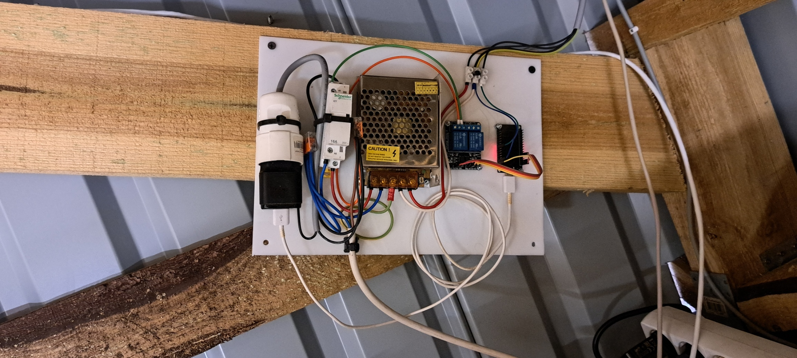
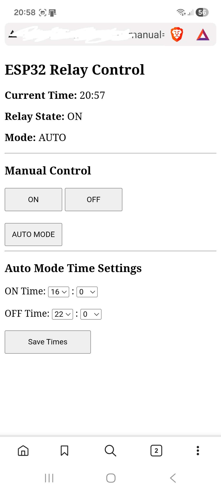

# 🌟 ESP32 Multi-Mode NeoPixel Animator

A fast, non-blocking **LED animation engine** for ESP32 built around the Adafruit NeoPixel library.  
Includes multiple effects such as **bouncing comets**, **smooth comets** — all switchable via a **web page** or in auto mode with time triggers.

Designed for **large LED strip projects (300+ LEDs)** with smooth animations and minimal CPU load.

---

## ✨ Features

- 🟦 **Mode 1 – Bouncing Comets**  
  Colorful comets bounce off the strip edges and change color after random rebounds.

- 🟧 **Mode 2 – Streaming Comets**  
  Smooth one-direction comets with randomized speeds and respawn behavior.

- 🔁 **Hardware Switching**  
  Relay switches on/off 12V power supply (led strip works on the evenings)
  With manual mode can turn on/off any time you want.

- ⚡ **Fully Non-Blocking Engine**  
  Zero delays — all timing uses `millis()` for perfect smoothness.

- 🧩 **Modular Code Design**  
  Each mode is in its own function (`mode1()`, `mode2()`), easy to extend.

-⚠️ Important Note About Long LED Cables (WS2815)

When using longer data cables with WS2815 LED strips (generally anything over 1–2 meters), the signal may degrade and cause flickering or unstable behavior.
To avoid this, you must use a level shifter to convert the ESP32’s 3.3V data signal to 5V.

---
## 📐 Schematic

## 🔌 Wiring

## 📜 Web page

## 📷 Demo Video

